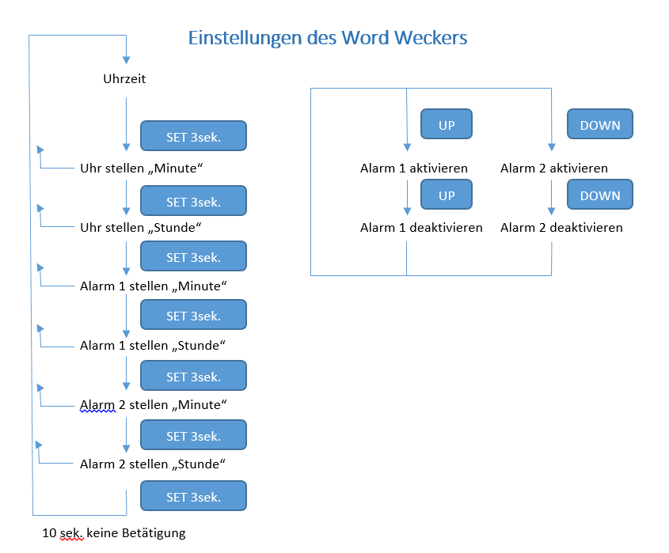

=======================

# Wort Wecker PingPong
Das hier vorgestellte Projekt basiert auf dem Retro Ping-Pong Spiel von Franzis.
Dabei wird die Uhrzeit als Text dargestellt.
Der Basiscode wurde um ein paar Funktionen erweitert, sodass es jetzt möglich ist, 
2 Weckzeiten zu definieren. Als Weckton wird ein 1,2KHz Ton erzeugt.
Über 3 Tasten kann die Uhrzeit und die Weckzeiten eingestellt werden.
Im nomalen Modus kann mit der UP-Taste der Alarm 1 und der DOWN-Taste der Alarm 2 
An- und Ausgeschaltet werden.

### Zusätzlich benötigte Bauteile
* Uhrenquarz 32,768 kHz
* 3 Taster
* Piezo Signalgeber
* Stiftleiste z.B. für ISP, Taster, Piezo und Vcc

## Installation
## Bauteile
B6 und B7 = Uhrenquarz  
C4 = Taster UP  
C5 = Taster DOWN  
D2 = Taster Stellen  
D0 = (RXD) geplant für NTP  
D1 = (TXD) geplant für NTP  
D3 = Piezo Signalgeber
## Compiler
Compiliert wurde das ganze im Atmel Studio 7 (7.0.1006)
Die Fuse muss noch auf den externen Uhrenquarz umgestellt werden. 

LowFuse: 0xE4  
HighFuse: 0xC9  

Beispiel avrdude
```
# Get fuses with USBasp
```
avrdude -c USBasp -p Atmega8 -n -v
```
# Ausgabe sieht so aus:
avrdude: auto set sck period (because given equals null)
avrdude: AVR device initialized and ready to accept instructions

Reading | ################################################## | 100% 0.02s

avrdude: Device signature = 0x1e9307
avrdude: safemode: lfuse reads as E4
avrdude: safemode: hfuse reads as D9

avrdude: safemode: lfuse reads as E4
avrdude: safemode: hfuse reads as D9
avrdude: safemode: Fuses OK

avrdude done.  Thank you.

# Nun die Fuses richtig setzen
```
avrdude -c USBasp -p Atmega8 -U lfuse:w:0xE4:m -U hfuse:w:0xC9:m
```
# Die Ausgabe muss nun so aussehen:
avrdude: AVR device initialized and ready to accept instructions

Reading | ################################################## | 100% 0.02s

avrdude: Device signature = 0x1e9307
avrdude: reading input file "0xE4"
avrdude: writing lfuse (1 bytes):

Writing | ################################################## | 100% 0.02s

avrdude: 1 bytes of lfuse written
avrdude: verifying lfuse memory against 0xE4:
avrdude: load data lfuse data from input file 0xE4:
avrdude: input file 0xE4 contains 1 bytes
avrdude: reading on-chip lfuse data:

Reading | ################################################## | 100% 0.02s

avrdude: verifying ...
avrdude: 1 bytes of lfuse verified
avrdude: reading input file "0xC9"
avrdude: writing hfuse (1 bytes):

Writing | ################################################## | 100% 0.02s

avrdude: 1 bytes of hfuse written
avrdude: verifying hfuse memory against 0xC9:
avrdude: load data hfuse data from input file 0xC9:
avrdude: input file 0xC9 contains 1 bytes
avrdude: reading on-chip hfuse data:

Reading | ################################################## | 100% 0.00s

avrdude: verifying ...
avrdude: 1 bytes of hfuse verified

avrdude: safemode: Fuses OK

avrdude done.  Thank you.
```

## Benutzung
Mit langen Druck auf den Taster PD2 kommt man in die Einstellungen. Das Menü sieht wie folgt aus:


## Druckvorlage
Die Druckvorlage ist mit dem Tool "Gimp2" erstellt. Diese ist unter resources zu finden.

## Contributing
1. Fork it!
2. Create your feature branch: `git checkout -b my-new-feature`
3. Commit your changes: `git commit -am 'Add some feature'`
4. Push to the branch: `git push origin my-new-feature`
5. Submit a pull request :D

## History
Author:     Martin Steppuhn
* 18.12.2009 Initial version  

Editor:		  Lars Weimar  
* 06.10.2016  
Update to Atmel Studio 7  
Delete uart routine  

*07.10.2016 ver.0.0.1  
Moved Word lines to get Alarm1 and Alarm2 to bottom  
Added Alarm1 and Alarm2 Vars and Words  
Added routines to set alarm times  
* 08.10.2016 ver.0.0.2  
Added ADC to get 2 more inputs on ADC6, ADC7  
Added UP/DOWN buttons  
* 09.10.2016 ver.0.0.3  
Added EEPROM to save alarm times  
* 09.10.2016 ver.0.0.4  
Changed to 24h clock  
Bugfix alarm  
## Quellen
Schaltplan: http://www.elo-web.de/xattachment/0911PingPongSchaltbild.jpg  
Ursprungs C-Code: www.emsystech.de  
 
## License
Copyright (c) Martin Steppuhn (www.emsystech.de)

Nur für den privaten Gebrauch / NON-COMMERCIAL USE ONLY

Die Nutzung (auch auszugsweise) ist für den privaten und nichtkommerziellen 
Gebrauch erlaubt. Eine Veröffentlichung und Weiterverwendung des Quellcodes 
ist möglich wenn diese Nutzungsbedingungen incl. Copyright beiliegen
und die Quelle verlinkt ist. (www.emsystech.de)

Bei kommerziellen Absichten nehmen Sie bitte Kontakt mit uns auf 
(info@emsystech.de)

Keine Gewähr auf Fehlerfreiheit, Vollständigkeit oder Funktion. Benutzung 
auf eigene Gefahr. Es wird keinerlei Haftung für direkte oder indirekte 
Personen- oder Sachschäden übernommen.
